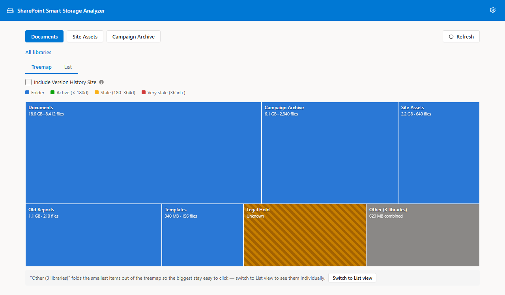

# SharePoint Smart Storage Analyzer — Storage Usage & Archival Report Web Part

[](https://sharepointsmartsolutions.com/smart-data-analyzer) [](USER-GUIDE.md) [](../../releases/latest) [](LICENSE)

A free, open-source SPFx web part that helps SharePoint site owners find storage that's safe to archive — browsing libraries and folders, and scanning a site for stale files — entirely from the browser, with no PowerShell or third-party tools required.

    

---

## Features

> **Requires Site Owner access.** Storage totals rely on the same right as classic Site Settings → Storage Metrics. Anyone without Site Owner access will see the web part with a clear warning banner instead of data.

### Explorer

Opens directly into a WizTree-style treemap of the site's default document library — no picker screen first.



| Feature | Description |
|---|---|
| **Treemap drill-down** | Click any folder square to zoom into it; square size reflects storage weight at a glance |
| **Library switcher** | A button row switches between every document library on the site without leaving the view |
| **Breadcrumb navigation** | Jump back to any ancestor folder in one click |
| **List View** | Toggle to a sortable table of the same folder's contents — folders and files together, largest first by default |
| **Excel / CSV export** | Export the current List View (name, size, item count, modified date, archival status) to `.xlsx` or `.csv` |
| **Archival status** | Files are tagged Active / Stale / Very stale based on configurable last-modified thresholds, shown in both the treemap and the list |

Both view modes share the same drill-down state — switching from Treemap to List (or vice versa) keeps you in the same folder.


### Storage Report

Scan a site — and optionally its subsites — and export a report of archival candidates.


| Feature | Description |
|---|---|
| **Configurable scope** | Include subsites and hidden/system libraries in the scan |
| **Concurrent, throttling-aware scan** | Adjustable request concurrency with a live progress bar, file count, and elapsed timer |
| **Archival tiering** | Every file is classified Active, Stale, or Very stale based on configurable last-modified thresholds |
| **In-browser results table** | Sortable results with a toggle to show only archival candidates |
| **Excel export** | Color-coded `.xlsx` workbook with a Summary sheet and a full file-level Details sheet |
| **CSV export** | Plain-text alternative for scripted processing |
| **Scan history** | Past scans persist in IndexedDB, browsable without re-scanning |
| **Report compare** | Diff two saved scans to see size change, new archival candidates, and resolved items over time |

---

## Prerequisites (for Development Only)

| Requirement | Detail |
|---|---|
| **Node.js** | 18.x (`>=18.17.1 <19.0.0`) |
| **gulp-cli** | Install globally: `npm install -g gulp-cli` |
| **SharePoint** | Online (Microsoft 365) |
| **SPFx** | 1.21.1 |
| **Permissions to deploy** | Site Owner or above |

---

## Development Setup

```bash
# Install dependencies
npm install

# Edit config/serve.json and set initialPage to your hosted workbench URL:
# "initialPage": "https://<your-tenant>.sharepoint.com/sites/<your-site>/_layouts/workbench.aspx"

# Start the local dev server (opens hosted workbench)
gulp serve
```

The local workbench at `https://localhost:4321/temp/workbench.html` does not have SharePoint REST API access. Use the **hosted workbench** URL above for full functionality.

---

## Build & Deploy

```bash
# Production bundle (minified, ship mode)
gulp bundle --ship

# Create the .sppkg deployment package
gulp package-solution --ship

# Or run both in one step:
npm run ship
```

The package is written to `sharepoint/solution/smart-storage-analyzer.sppkg`.

**Deploy to SharePoint:**

1. Upload `smart-storage-analyzer.sppkg` to the tenant or site App Catalog.
2. Click **Deploy** when prompted.
3. Navigate to the SharePoint page where you want to add the web part, click **Edit**, and add **Smart Storage Analyzer** from the web part picker.

---

## Configuration

To change web part settings, put the page in **Edit** mode, click the web part pencil icon, and use the property pane. Everything else — scope, archival thresholds, and scan concurrency — is configured from the in-app **Settings** screen.

**General (property pane)**

| Setting | Default | Description |
|---|---|---|
| **Default view on open** | Explorer | The screen shown when the web part first loads. Options: Explorer, Storage Report |

**Scope (in-app Settings)**

| Setting | Default | Description |
|---|---|---|
| **Include subsites in Storage Report scans** | Off | Also walks every subsite beneath the current site. Does not affect Explorer |
| **Include system and hidden libraries** | Off | Includes Style Library, Form Templates, and other libraries normally hidden from default views. Applies to all tools |

**Archival thresholds (in-app Settings)**

| Setting | Default | Description |
|---|---|---|
| **Stale after (days)** | 180 | Files not modified in this many days are flagged "Stale" — a candidate for review |
| **Very stale after (days)** | 365 | Files not modified in this many days are flagged "Very stale" — a strong archival candidate |

**Performance (in-app Settings)**

| Setting | Default | Description |
|---|---|---|
| **Concurrent API requests** | 6 | How many SharePoint API requests run in parallel during scans and folder loads (1–15). SharePoint's throttling limit is dynamic, not fixed — the app retries automatically on HTTP 429, but very high values can still net out slower |

---

## Project Structure

```
src/webparts/smartStorageAnalyzer/
├── components/
│   ├── App.tsx                        # Root component — routing, header nav, permission check, theme wiring
│   ├── ExplorerView.tsx               # Default view — library switcher, treemap + list drill-down, export
│   ├── StorageReportView.tsx          # Scan configuration, results, history, compare
│   ├── SettingsView.tsx               # Full-page settings screen
│   └── shared/                        # Shared UI: StorageTable, SizeBar, Treemap, tier badges
├── services/
│   ├── StorageAnalyzerService.ts      # Facade over the sp/ modules (stable public API)
│   ├── sp/                            # API client, site discovery, storage metrics, library stats, scan
│   ├── ExcelExportService.ts          # ExcelJS workbook generation (lazy-loaded chunk)
│   └── ReportHistoryService.ts        # IndexedDB-backed scan history
├── utils/
│   ├── archivalClassification.ts      # Age calculation and Active/Stale/VeryStale tiering
│   ├── reportDiff.ts                  # Pure diff between two stored reports
│   └── treemapLayout.ts               # Squarified treemap layout algorithm
├── models/
│   └── models.ts                      # Shared TypeScript interfaces
└── SmartStorageAnalyzerWebPart.ts       # SPFx entry point, property pane, theme wiring

config/
├── package-solution.json              # Solution ID, version
└── serve.json                         # Local dev server config — set initialPage here
```

---

## Key Dependencies

| Package | Purpose |
|---|---|
| `@microsoft/sp-webpart-base` | SPFx web part base class and framework integration |
| `@fluentui/react-components` | Fluent UI v9 — components and theme tokens |
| `react` / `react-dom` | UI rendering (v17) |
| `exceljs` | In-browser Excel workbook generation for report exports (lazy-loaded) |

---

## Troubleshooting

**"I see a yellow warning banner and no data"** — The signed-in account does not have Site Owner access. Storage totals rely on the same right as classic Site Settings → Storage Metrics. Ask a site owner to grant Owner access or run the tool on your behalf.

**"gulp serve opens but the web part shows no data"** — The local workbench (`localhost:4321`) cannot authenticate to SharePoint REST. Switch to the hosted workbench: edit `config/serve.json` and set `initialPage` to `https://<tenant>.sharepoint.com/_layouts/15/workbench.aspx`.

**"npm install fails" or build errors about Node version** — This project requires Node 18.x exactly (`>=18.17.1 <19.0.0`). Run `node --version` to confirm. Use `nvm` or `nvm-windows` to switch versions.

**"A library's size shows as an Estimate"** — SharePoint's Storage Metrics rollup is not available for that library (common right after content changes, before the rollup recalculates). The tool falls back to an on-the-fly estimate and badges it as such.

**"The Storage Report scan takes a very long time"** — Scan time scales with file count and, if enabled, the number of subsites. Narrow the scope in Settings (disable subsites or hidden libraries) or lower scan concurrency if you're seeing throttling (HTTP 429) errors.

---

## Limitations

- All tools require **Site Owner** access. Members, Visitors, Limited Access users, and guests cannot use any feature.
- Archival tiering is based on **last modified date only** — SharePoint does not expose a reliable last-accessed signal at scale.
- This tool reports and browses storage; it does not move, archive, or delete anything.
- Runs entirely as the signed-in user — results reflect that user's view and access.
- Scan history persists in **IndexedDB** in the browser, capped at the 10 most recent scans. Clearing browser data removes all saved scan results.

---

## License

[MIT](LICENSE) © 2026 Sean Regan
