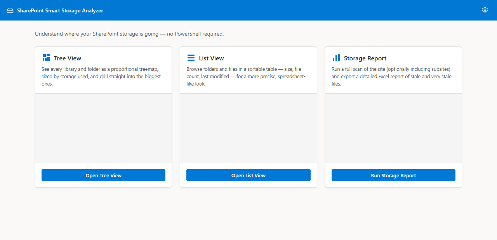
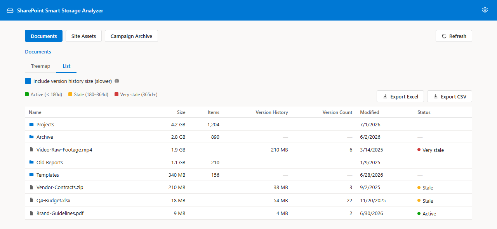
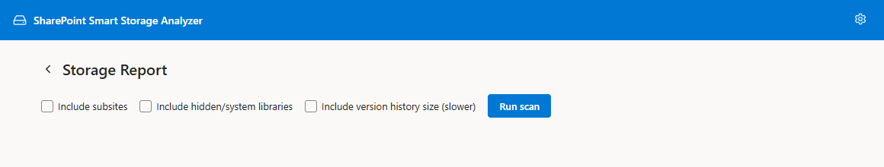
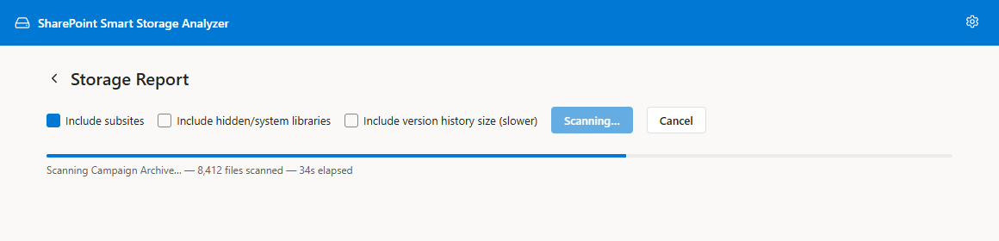
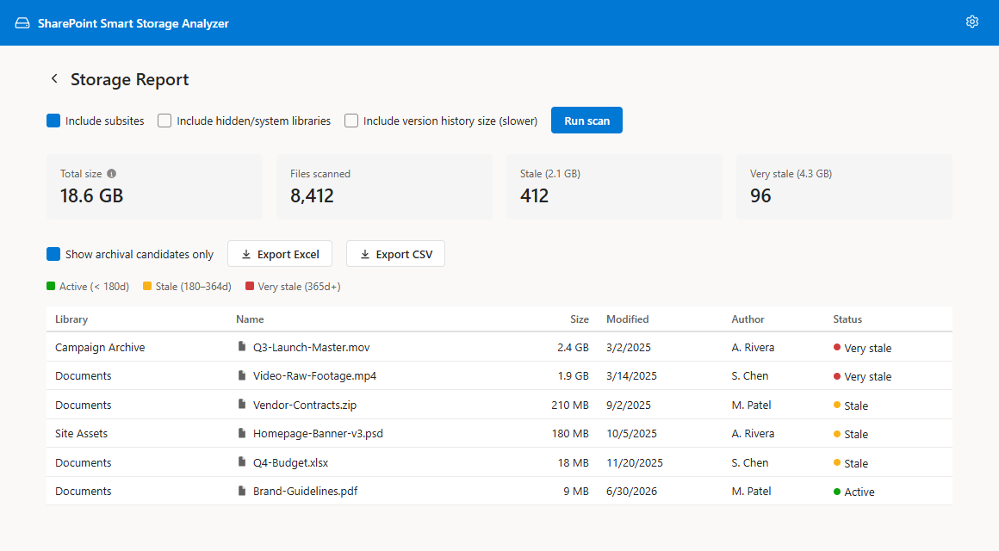
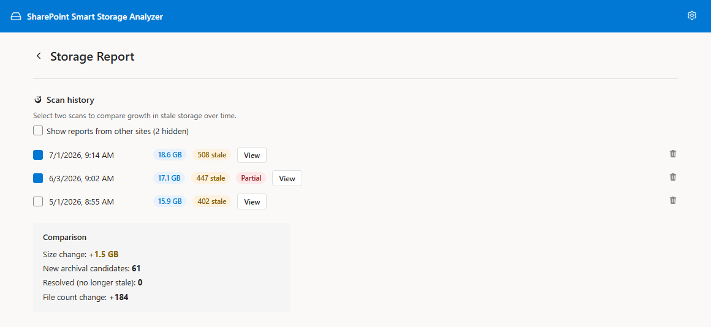
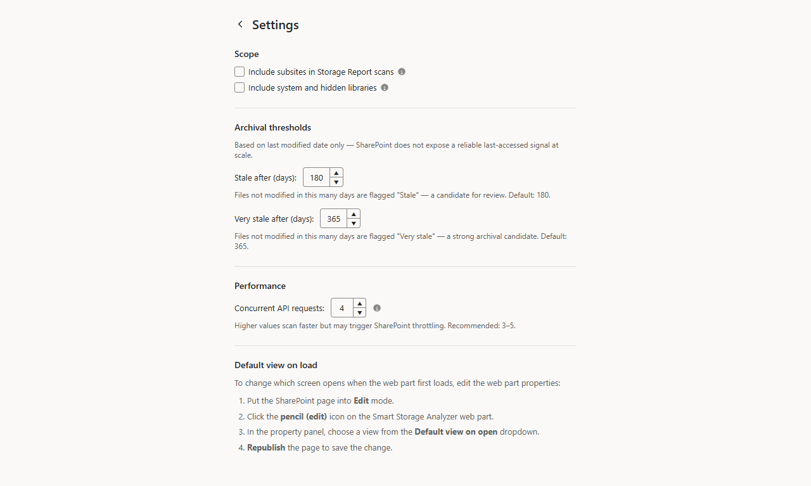

# SharePoint Smart Storage Analyzer — User Guide

**Version 1.3.0**
**Applies to:** SharePoint Online

---

## Table of Contents

1. [Overview](#overview)
2. [Who Is This For?](#who-is-this-for)
3. [Getting Started](#getting-started)
4. [Home](#home)
5. [Tree View & List View](#tree-view--list-view)
6. [Storage Report](#storage-report)
7. [Understanding Archival Status](#understanding-archival-status)
8. [Settings](#settings)
9. [Web Part Configuration](#web-part-configuration)
10. [Security & Privacy](#security--privacy)
11. [Frequently Asked Questions](#frequently-asked-questions)
12. [Troubleshooting](#troubleshooting)

---

## Overview

**SharePoint Smart Storage Analyzer** is a browser-based storage-auditing tool built directly into SharePoint Online as a web part. It helps site owners find storage that's safe to archive or clean up — browsing libraries and folders visually, and scanning a whole site for stale files — entirely from the browser, with no PowerShell, no third-party tools, and no IT assistance required.

SharePoint's default interface makes it hard to see *where* storage is actually going. Libraries show a single total, folders don't show their own size, and there's no built-in way to ask "what's old and safe to remove?" Smart Storage Analyzer answers both questions from a single interface: an interactive treemap and sortable list for visual exploration, and a full-site scan for a complete, exportable report.

### What You Can Do

The web part opens on a **Home** screen with three cards to choose from:

| Tool | Purpose |
|------|---------|
| **Tree View** | Visually browse a document library as a size-weighted treemap, drilling into any folder to see what's using space |
| **List View** | Browse the same libraries and folders as a sortable table — size, item count, modified date — for a more precise, spreadsheet-like look |
| **Storage Report** | Scan an entire site (optionally including subsites) and produce a full report of every file, tagged by how stale it is |

Tree View and List View are two doors into the same screen — once inside, a tab lets you switch between them without losing your place. See [Tree View & List View](#tree-view--list-view).

---

## Who Is This For?

- **Site Owners** who need to understand where a site's storage is going and what's safe to archive
- **IT Administrators** doing periodic storage cleanup or preparing for a storage-quota conversation
- **Anyone asked "why is this site so big?"** who needs a fast, visual answer without exporting anything first

> **Note:** The web part runs as the currently signed-in user and only shows content, and total sizes for, sites that user can access. See [Getting Started](#getting-started) for the permission level required.

---

## Getting Started

### Prerequisites

You must be a **Site Owner** on the site (or otherwise hold the Manage Web / Manage Permissions right). Reading a folder or library's rolled-up storage size relies on the same underlying right as classic **Site Settings → Storage Metrics**. Anyone without it — Members, Visitors, and guests — will see the web part, but a warning banner instead of data.

### Accessing the Web Part

The web part is added to a SharePoint page by a site owner or administrator. Once added, navigate to the page where it has been placed — the web part automatically connects to that site; no setup or configuration is required to get started.

By default, it opens on the **Home** screen, where you pick Tree View, List View, or Storage Report. (A site administrator can change this so the web part opens directly on one of the three instead — see [Web Part Configuration](#web-part-configuration).)

### If You Don't Have Access

If your account lacks the required permission, a banner appears below the header:

> **Site Owner access required —** Storage totals rely on the same right as classic Site Settings → Storage Metrics. Contact a site owner if you have questions.

Contact a site owner to request access, or have them run the tool on your behalf.

---

## Home

Home is the landing screen the web part opens on by default — three cards, one per tool:

- **Tree View** — opens the treemap, sized by storage.
- **List View** — opens the same libraries and folders as a sortable table.
- **Storage Report** — opens the full-site scan and export tool.

Click a card (or its button) to open that tool. Every tool has a **Home** button near the top to bring you back to this screen. The gear icon in the top-right corner opens [Settings](#settings) from Home just as it does from any other screen.

If your account lacks Site Owner access, Home shows the same warning banner described in [If You Don't Have Access](#if-you-dont-have-access), and the three cards are grayed out (hover one for a reminder of what's required) since none of them can show real data without it.

---

## Tree View & List View

### What It Does

Tree View and List View are two entry points into the same screen — a **treemap or table of every document library on the site**, each library sized by how much storage it uses, so the first thing you see answers "which library is the storage actually in?" Click a library to drill into it, then keep clicking folders to go deeper. Each rectangle (or row) is a library, folder, or file, sized proportionally to its storage in the treemap, so the biggest space users are visually obvious at a glance.

Whichever card you clicked from Home decides which of the two tabs — Treemap or List — you land on; a tab lets you switch between them at any time without losing your place. A **Home** button near the top returns you to the [Home](#home) screen.

The breadcrumb always starts at **All libraries**; click it to return to the site-wide view. The button row along the top also switches libraries directly, if you'd rather skip a step.

> **Note on library sizes:** these come from SharePoint's own rolled-up storage figures, which are recalculated by a periodic background job and can lag recent activity. A library SharePoint hasn't reported a size for yet appears as **"Unknown"** (a striped square) rather than as 0 bytes. Open it and the tool measures it exactly. This is deliberate — measuring every library exactly up front would mean walking the entire site just to draw the opening screen.

### The Treemap View

- **Square size = storage weight.** Bigger rectangles use more space. Libraries and folders are shown in blue; files are colored by their [archival status](#understanding-archival-status). A striped square means the size couldn't be determined — see the note above (at library level) or the throttling note below (at folder level).
- **Click a library or folder** to drill into it — the treemap updates to show that item's own contents.
- **Folder cells show their size and file count** (e.g. "24.6 MB · 138 files") when the cell is large enough to fit the text; smaller cells still show at least the name, and hovering any cell shows full detail in a tooltip.
- **A size starting with "≥"** (e.g. "≥ 340 MB") means the folder is larger than shown but measuring it further ran into this view's request budget before it could finish — it's a floor, not an estimate. Open the folder directly to measure deeper, or raise **Concurrent API requests** in Settings so more gets measured before the budget is reached. This is distinct from **"Unknown"**, which means nothing could be measured at all.
- The smallest items are floored to a minimum on-screen size so they stay easy to click even on a site with many small files — treemap proportions favor clickability slightly over strict mathematical precision for the tiniest items.
- **"Other (N items)"** appears when a folder has more items than the treemap can usefully draw as separate squares — the smallest ones are folded into a single gray cell instead of being drawn as slivers too small to see or click. Hovering it explains what's inside; a note above the treemap offers a one-click **Switch to List view** button, since the List view has no such folding and shows every item individually.
- While a folder's sizes are loading, a progress bar with a live **"N of M folders"** counter is shown instead of the treemap; the treemap appears once every size has resolved.

### The List View

Click the **List** tab to switch to a sortable table of the same folder's contents — folders and files together, largest first by default. Click any column header to sort by it; click again to reverse. This view is often more convenient than the treemap when you want to scan names and exact sizes rather than compare visually.

Switching between Treemap and List keeps you in the same folder — you don't lose your place.

### Including Version History Size

Above both the Treemap and List views, an **"Include version history size (slower)"** checkbox controls whether the currently-viewed folder's files also report how much extra storage is used by their retained older versions — SharePoint keeps prior versions of a file, and that older content is real storage on top of the file's current size, not included in it. A small info icon next to the checkbox is a reminder that this only ever applies to individual files: a **folder's** own size (in either view) never includes version history, because SharePoint has no recursive version-history rollup to read it from — only a per-file lookup.

This only applies to the files currently listed (not a recursive rollup for the whole library), but it does mean an extra lookup per file, so leave it off unless you specifically need version-history detail — it will make the folder noticeably slower to load with many files.

In the **Treemap**, turning this on changes how file squares are sized: each file square is weighted by its file size *plus* its version-history size combined, so files with a lot of retained version history appear visibly larger. Hovering a file (or, for a large enough square, the text shown directly on it) breaks the total back down, e.g. "24.6 MB (18.2 MB file + 6.4 MB version history)". Folder squares are unaffected — they keep showing file-content size only, for the reason above.

In the **List View**, turning this on adds two columns: **Version History** (the retained-version storage, in human-readable form) and **Version Count** (how many older versions are being kept — the current version is not counted).

### Refreshing

Folder and library sizes are cached briefly after loading so repeat visits are fast. If you've just added, deleted, or moved files and want the view to reflect that immediately rather than waiting for the cache to expire, click **Refresh** — it clears the cached sizes for the current site and re-measures everything you're currently viewing.

### Library Switcher and Breadcrumbs

- The button row at the top switches between every document library on the current site without leaving Tree View / List View.
- The breadcrumb trail below it shows your current path from the library root; click any earlier segment to jump back to it.

### Exporting

From the **List** view, use **Export Excel** or **Export CSV** to download the current folder's listing — name, size, item count, modified date, archival status, and version history size and count (if that toggle is checked) — for the folder you're currently viewing (not the whole site; use [Storage Report](#storage-report) for that). The exported filename includes the site's name, so files from different sites don't collide when saved to the same folder.

---

## Storage Report

### What It Does

The Storage Report scans an entire site — and optionally every subsite beneath it — and classifies every file it finds as Active, Stale, or Very stale based on how long it's been since it was last modified. Where Tree View and List View are for visual browsing, the Storage Report is for producing a complete, exportable, and comparable record.

### Running a Scan

1. From [Home](#home), click **Storage Report** (or click **Home** from another screen, then choose it).
2. Optionally check **Include subsites** to also walk every subsite beneath the current site.
3. Optionally check **Include hidden/system libraries** to also scan Style Library, Form Templates, and other libraries normally hidden from default views.
4. Optionally check **Include version history size (slower)** — see [below](#version-history-in-the-storage-report).
5. Click **Run scan**.

While the scan runs, a progress bar tracks how many libraries have been processed, alongside a live file count and an elapsed timer. If a scan is taking too long or you started it by mistake, click **Cancel** — the scan stops and shows whatever results it had already collected, clearly labeled as partial. A canceled scan is not saved to Scan History.

### Version History in the Storage Report

Checking **Include version history size (slower)** adds two per-file columns to the results table — **Version History Size** (shown both in human-readable form and in raw bytes) and **Version Count** (how many older versions are retained) — and, once the scan completes, an extra summary tile, **Version History Size**, showing the total across every file scanned. An info icon next to that tile explains that this figure is *additional* storage on top of Total size, not a subset of it: version history is real space consumed by older, retained copies of a file's content.

Because this requires one extra lookup per file across the entire scan, expect a full scan with this enabled to take meaningfully longer than one without it, especially on large sites — leave it unchecked for a quick size overview and turn it on when you specifically need to account for version-history storage.

### If Some Folders or Subsites Can't Be Read

If part of the site couldn't be scanned — a folder that errors out, or (with **Include subsites** on) a subsite the current user can't access — the results are still shown, but a warning banner notes that the results are partial and how many folders/subsites were skipped. If **Include version history size** was on and some files' version history specifically couldn't be read (this happens independently of the folder/subsite skips above, most often due to throttling), the same banner also states how many files' version history was skipped, so a low or zero version-history total isn't mistaken for "this site has no old versions." Click **Show details** to see the specific folder URLs and the error each one hit, with a **Copy to clipboard** button so you can pass the list along (e.g. to request access, or to investigate separately).

### Browsing the Results

Once the scan completes, summary tiles show the total size scanned, total files, and the count and size of Stale and Very-stale files (plus Version History Size, if that option was enabled). An info icon next to **Total size** is a reminder that it's an exact sum of every scanned file's current content only — never an estimate, and never including version history, whether or not that option was on for the scan. Below the tiles, the full results table lists every file — library, name, size, version history size and count (if enabled), modified date, author, and archival status — sortable by any column.

Check **Show archival candidates only** to filter the table (and the exports) down to Stale and Very-stale files, hiding Active ones.

### Exporting

- **Export Excel** — a color-coded `.xlsx` workbook with a Summary sheet and a full file-level Details sheet.
- **Export CSV** — a plain-text alternative for scripted processing or import into another tool.

Both exported filenames include the site's name, so reports from different sites don't collide when saved to the same folder. Reopening a saved scan from a different site (via **Show reports from other sites**, below) and exporting it uses that scan's own site name, not the site the web part is currently on.

### Scan History

Every completed scan is saved automatically to a history log in your browser (the 10 most recent scans are kept; older ones are dropped automatically). For very large scans, only Stale and Very-stale files are retained in a saved report once it exceeds 50,000 rows — a **"Partial"** badge appears on that history entry to make clear that some Active-file rows were not saved, even though the summary totals reflect the full scan.

Scroll down to **Scan history** to see past scans by date, with their total size, stale-file count, and a version-history-size badge if that scan included it. By default, only scans of the current site are shown; check **Show reports from other sites** to reveal scans saved while using the web part on other sites (scan history is stored per-browser, shared across every site you've used the tool on, not per-site).

Click **View** on any entry to reload those results without re-scanning — the reloaded report shows its *own* saved settings (the stale/very-stale thresholds and version-history option in effect at the time it was scanned), not your current Settings, so an old report always reflects exactly what was true when it ran. Use the delete icon to remove a saved scan.

### Comparing Reports

Check the boxes next to any **two** saved scans to see a **Comparison** panel showing what changed between them: size change, new archival candidates, resolved (no-longer-stale) items, and the file-count delta. If the two selected scans were run against different sites, a warning notes this before you draw conclusions from the comparison. This is the easiest way to track whether a cleanup effort is actually working over time — run a scan on a schedule (e.g. monthly) and compare each new one against the last.

---

## Understanding Archival Status

Every file is classified into one of three tiers based on its **last modified date only** — SharePoint does not expose a reliable last-*accessed* signal at scale via REST, so modification date is the most reliable proxy available.

| Status | Meaning |
|--------|---------|
| **Active** | Modified within the "stale" threshold — business as usual |
| **Stale** | Not modified in at least the "stale" threshold (default: 180 days) — worth a look |
| **Very stale** | Not modified in at least the "very stale" threshold (default: 365 days) — a strong archival candidate |

Both thresholds are configurable in [Settings](#settings), and the legend shown on every screen always reflects your current configured values — not the defaults — so what you see on screen is always accurate to your setup.

> **The tool never deletes, moves, or archives anything.** It only reports and helps you browse — what you do with a Stale or Very-stale file (archive it, delete it, or leave it) is entirely up to you.

---

## Settings

Open **Settings** from the gear icon in the top-right corner of the header on any screen.

### Scope

| Setting | Default | Description |
|---------|---------|-------------|
| **Include subsites in Storage Report scans** | Off | Also walks every subsite beneath the current site. Only affects the Storage Report — Tree View and List View are always scoped to the current site. |
| **Include system and hidden libraries** | Off | Includes Style Library, Form Templates, and other libraries normally hidden from default views. Applies to both tools. |

### Archival Thresholds

| Setting | Default | Description |
|---------|---------|-------------|
| **Stale after (days)** | 180 | Files not modified in this many days are flagged "Stale." |
| **Very stale after (days)** | 365 | Files not modified in this many days are flagged "Very stale." |

### Performance

| Setting | Default | Description |
|---------|---------|-------------|
| **Concurrent API requests** | 6 | How many SharePoint API requests run in parallel during scans and folder loads (1–15). SharePoint's throttling threshold is dynamic, not a fixed number Microsoft publishes — the app retries automatically on throttling (HTTP 429/503/406) with an escalating backoff, but very high values can still net out slower than a moderate one. This also sizes how much Tree View / List View can measure before a fallback folder/library walk hits its request budget — raising it lets a walk go deeper before falling back to a "≥" (at least) result. |

If you see scans getting *slower* rather than faster as you raise this, that's throttling — turn it back down rather than waiting it out.

### Default View on Load

The Settings page also shows step-by-step instructions for changing which screen the web part opens on by default — see [Web Part Configuration](#web-part-configuration) below for the full walkthrough.

---

## Web Part Configuration

Site administrators can configure the web part's default behavior through the SharePoint property pane.

### Setting a Default View

By default, the web part opens on **Home**, letting the user choose. You can change this so it opens directly on **Tree View**, **List View**, or **Storage Report** instead — useful if the web part is placed on a page dedicated to one specific tool, such as periodic reporting.

**To change the default view:**

1. Navigate to the SharePoint page where the web part is installed.
2. Put the page into **Edit** mode.
3. Click the web part, then click its **pencil (edit)** icon.
4. In the property pane, under **General**, use the **Default view on open** dropdown to choose **Home**, **Tree View**, **List View**, or **Storage Report**.
5. **Republish** the page to save the change.

---

## Security & Privacy

### How It Works

Smart Storage Analyzer runs entirely inside your browser as a SharePoint web part. It makes direct calls to the **SharePoint REST API** using your signed-in credentials — the same API SharePoint itself uses.

### Key Security Properties

| Property | Detail |
|----------|--------|
| **No elevated permissions** | The tool uses only your existing access rights. It cannot see anything you couldn't already see. |
| **Read-only** | The tool never creates, modifies, moves, archives, or deletes any SharePoint content. It only reads and reports. |
| **No external services** | All data stays within your Microsoft 365 tenant. Nothing is sent to any external server or third-party service. |
| **Local-only history** | Saved Storage Report scans are stored in your browser's IndexedDB, not on any server. Clearing browser data removes them. |
| **Standard authentication** | Authentication is handled entirely by SharePoint and Microsoft 365. The web part never handles passwords or tokens directly. |

### What the Tool Can See

The tool can only access sites, libraries, folders, and files that **your account** already has permission to view.

---

## Frequently Asked Questions

**Q: Do I need any special permissions to use this tool?**
A: Yes — you must be a **Site Owner** (or hold the Manage Web / Manage Permissions right). Storage totals rely on the same right as classic Site Settings → Storage Metrics.

---

**Q: Will using this tool change, move, or delete anything?**
A: No. The tool is entirely read-only. It reports and helps you browse storage; it never modifies SharePoint content or settings.

---

**Q: What does "Version history size" mean, and is it counted separately from Total size?**
A: Yes, it's separate. SharePoint keeps older versions of a file every time it's edited, and those older versions take up real storage on top of the file's current content. Version history size is that extra amount — it's additive to Total size, not included in it. Enable **Include version history size** in Tree View / List View or Storage Report to see it (it adds an extra lookup per file, so scans take longer with it on).

---

**Q: Why does loading a folder with many subfolders take a moment?**
A: Each subfolder's size is a separate lookup. Sizes are cached for a short time after loading, so revisiting the same folder — even after a page refresh — is fast the second time. Lowering **Concurrent API requests** in Settings can help if you're seeing throttling; raising it can speed up first-time loads on fast tenants.

---

**Q: What's the difference between Tree View / List View and the Storage Report?**
A: Tree View and List View are for visual, interactive browsing of one library at a time — great for spotting what's big at a glance. The Storage Report is for a complete, exportable, and comparable record of every file across a whole site (and optionally its subsites), classified by staleness.

---

**Q: How is "stale" determined?**
A: By last-modified date only, compared against the two thresholds you can configure in Settings (default: 180 days for Stale, 365 for Very stale). SharePoint doesn't expose a reliable last-*accessed* signal at scale, so last-modified is the most practical proxy.

---

**Q: Can I compare two scans to see what changed?**
A: Yes. In the Storage Report, check the boxes next to any two saved scans in **Scan history** to see a comparison: size change, new archival candidates, resolved items, and file-count change. If the two scans were run against different sites, the panel warns you before you compare.

---

**Q: A saved scan shows a "Partial" badge — what does that mean?**
A: The scan itself completed fully, but the *saved copy* of it only kept Stale and Very-stale rows — this happens automatically once a scan's results exceed 50,000 rows, to keep browser storage manageable. The summary totals on that saved report still reflect the complete scan; only the row-by-row file list was trimmed.

---

**Q: Can I stop a scan partway through?**
A: Yes — click **Cancel** while a Storage Report scan is running. You'll see whatever results were collected before you canceled, clearly marked as partial. A canceled scan isn't saved to Scan History.

---

**Q: Is my data secure when I use this tool?**
A: Yes. The tool talks only to your own SharePoint environment via the standard Microsoft 365 REST API. No data is sent anywhere else. See [Security & Privacy](#security--privacy).

---

## Troubleshooting

### "Site Owner access required" banner instead of data

- Confirm you have Site Owner access (or the Manage Web / Manage Permissions right) on the site.
- Ask a site owner to grant access, or have them run the scan/export on your behalf.

### The Storage Report scan takes a long time

- Scan time scales with file count and, if enabled, the number of subsites. Try disabling **Include subsites**, **Include hidden/system libraries**, or **Include version history size** to narrow the scope, or lower **Concurrent API requests** if you're seeing throttling (HTTP 429) errors in the browser console.

### A scan or folder load pauses for a long stretch, then continues

- This is the tool deliberately waiting out SharePoint throttling. On large sites, SharePoint will ask clients to slow down (HTTP 429) and can request waits of a minute or more. When that happens, the tool pauses *all* of its requests for as long as SharePoint asks, automatically reduces how many requests it makes at once, and then speeds back up as things recover — so a long pause is it working correctly rather than hanging. Waiting is deliberately preferred over giving up, because the alternative is a report with gaps in it.
- If it happens constantly on your tenant, lower **Concurrent API requests** in Settings. Counter-intuitively, a lower value often finishes *faster* on a busy tenant, because it avoids triggering throttling in the first place.
- Browser console messages beginning `[SmartStorageAnalyzer] Throttled by SharePoint` confirm this is what's happening, and show the reduced concurrency being used.

### Tree View / List View says a folder "has no subfolders or files," but its size looked non-zero

- This means the folder's own file listing failed to load (a transient error or throttling) — an error banner should appear explaining what happened. If you don't see one, try reloading the folder; a genuinely empty folder never shows a non-zero size in its parent view in the first place.

### An error mentions "HTTP 406"

- This is SharePoint throttling, not a problem with a specific file or folder name — a 406 happens when SharePoint redirects an over-limit request to an HTML "please slow down" page instead of the JSON response the tool asked for. The tool treats it exactly like the more familiar HTTP 429: it pauses and automatically retries with backoff, the same as described [above](#a-scan-or-folder-load-pauses-for-a-long-stretch-then-continues). If it persists, lower **Concurrent API requests** in Settings rather than looking for anything wrong with the item itself.

### A scan finished with a warning that some folders or subsites were skipped

- This means part of the site couldn't be read — usually a permissions issue on a specific folder, or a subsite the signed-in user can't access. Click **Show details** on the warning banner to see exactly which URLs failed and why; **Copy to clipboard** to share that list with whoever needs to grant access.

### Export to Excel doesn't seem to do anything

- Try again — a transient network issue loading the export component can occasionally cause a single failed attempt. If it keeps failing, check the browser console for an error message, or try **Export CSV** instead, which has no external dependency.

### The web part shows no data at all in local development

- The local workbench (`localhost:4321`) does not have SharePoint REST API access. Use the **hosted workbench** (your actual SharePoint site's `/_layouts/15/workbench.aspx`) during development instead.

---

*Smart Storage Analyzer is a browser-based utility that runs within your Microsoft 365 environment. It does not store, transmit, or log any data outside of your browser session.*
